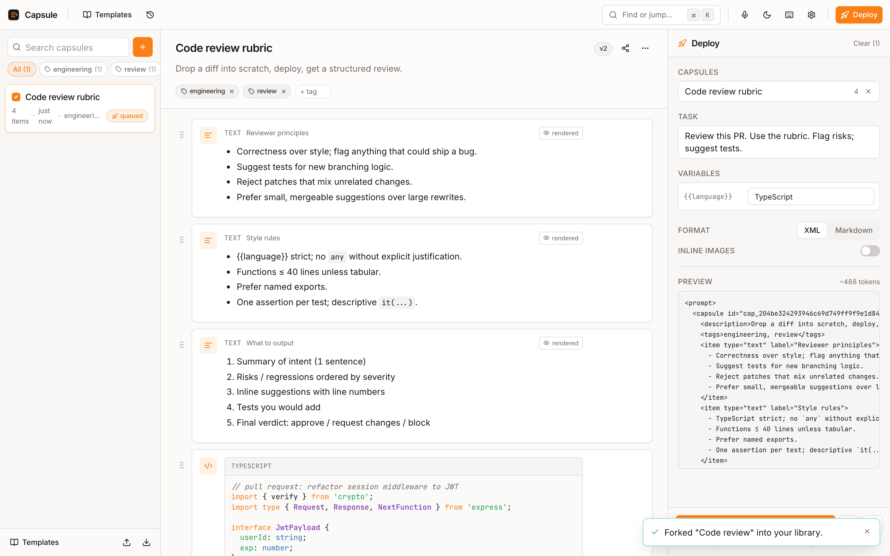
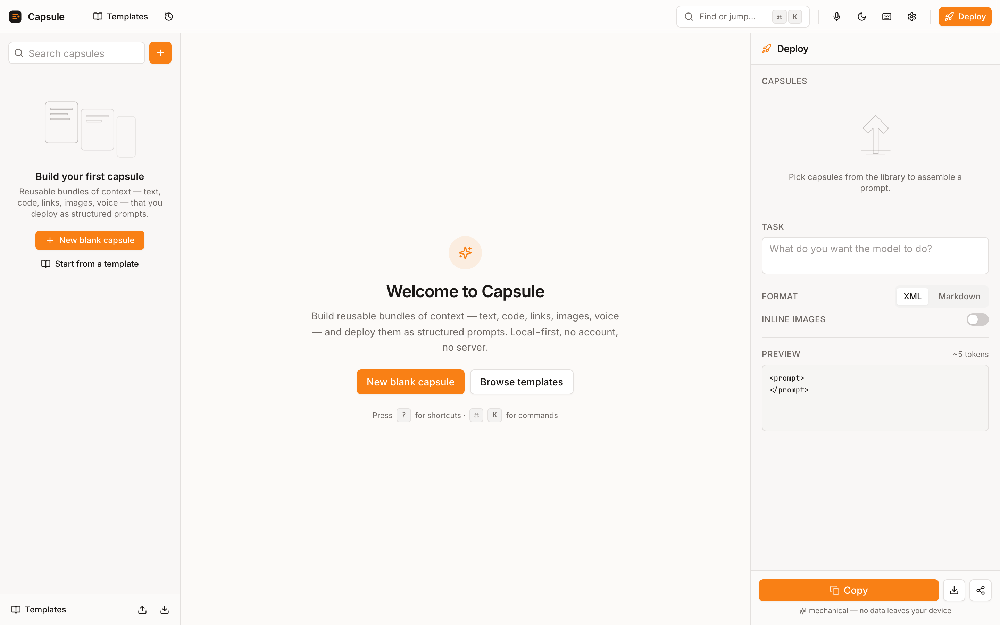
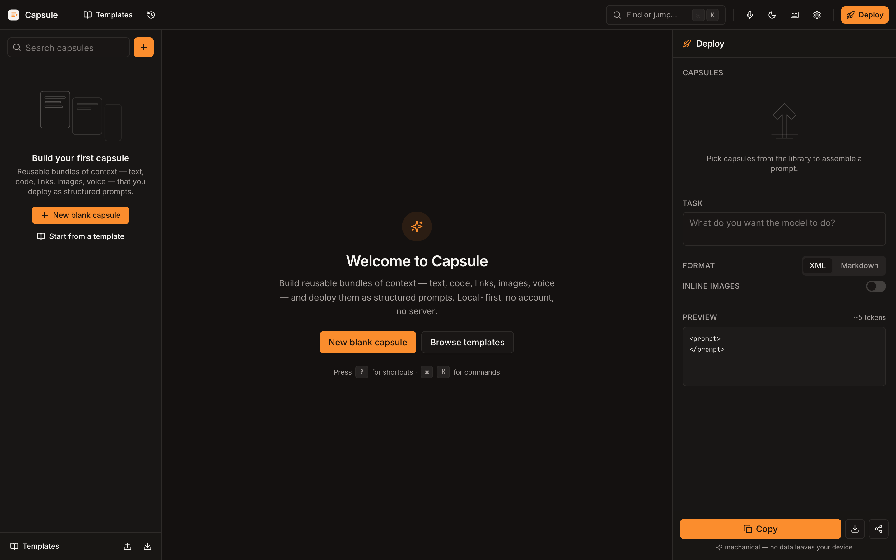
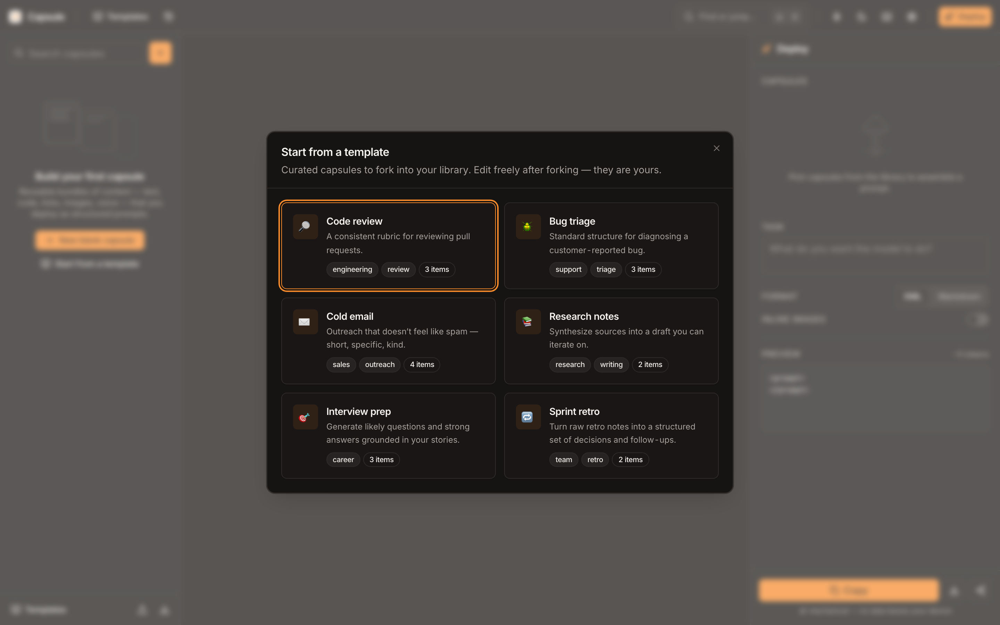
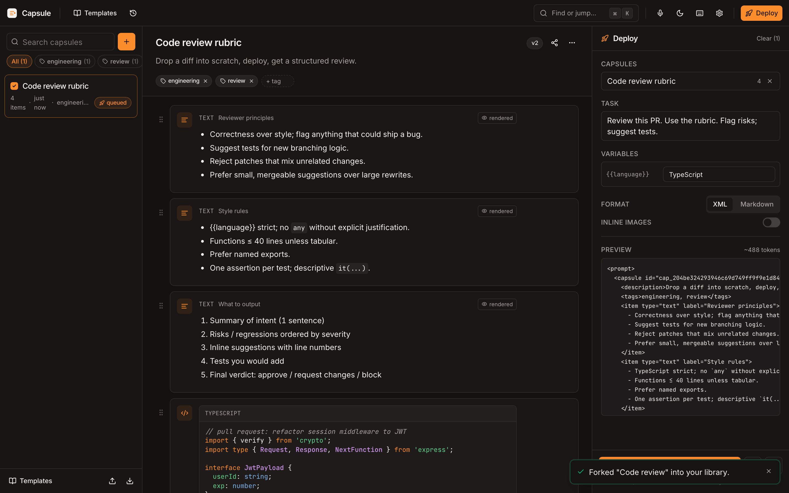
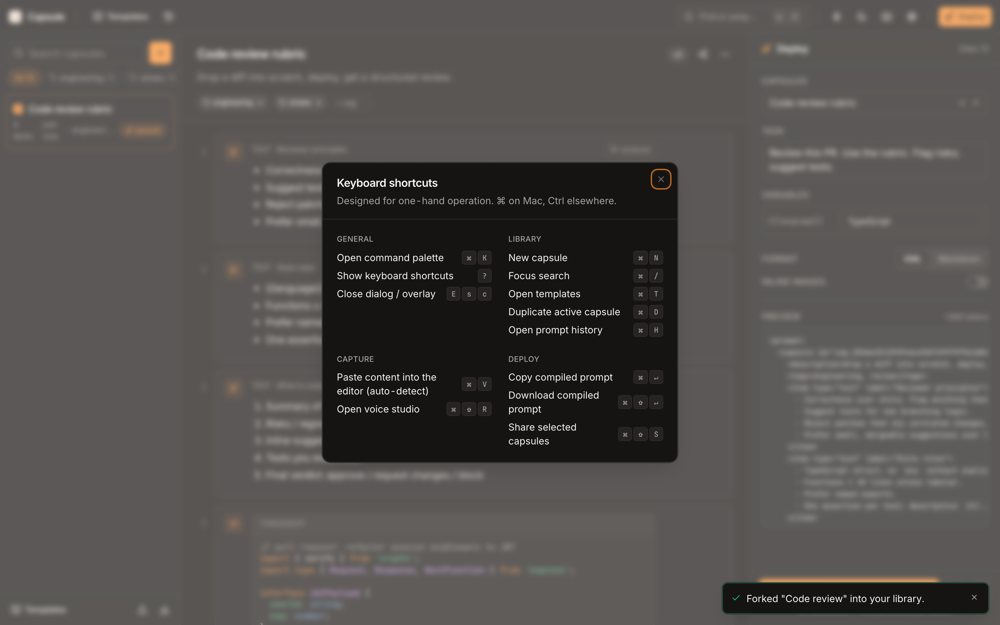
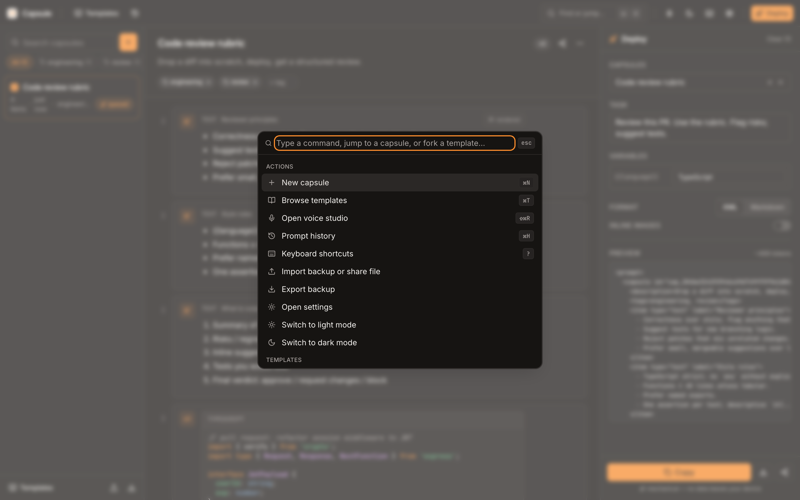
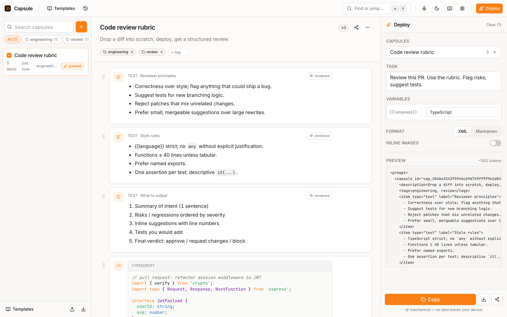

<div align="center">

# Capsule

**Local-first, browser-based LLM context-pack library.**

Build reusable bundles of context — text, code, links, images, voice — once,
deploy them as structured prompts forever. No account, no server, no telemetry.

### **[Live demo →](https://capsule-pied-theta.vercel.app)**

[](https://capsule-pied-theta.vercel.app)
[](tsconfig.json)
[](test/unit)
[](.eslintrc.cjs)
[](#tech-stack)
[](public/manifest.webmanifest)



</div>

---

## What is Capsule?

Most LLM workflows lose to friction. You re-paste the same project context into every conversation. You retype the same prompt structure for every code review. You lose your great prompts because they live in chat history. You worry about pasting a secret without realizing it.

Capsule fixes this with a single mental model:

> **Context becomes a first-class, reusable artifact.**

Build context bundles once — deploy them as structured LLM prompts forever, all in your browser.

It runs entirely in your browser. **No account. No server. No data leaves your device.**

---

## Screenshots

<table>
<tr>
<td width="50%"></td>
<td width="50%"></td>
</tr>
<tr>
<td><b>Welcome — light</b><br/>First-run state with onboarding hint and template suggestion.</td>
<td><b>Welcome — dark</b><br/>System-following theme with refined warm-neutral palette.</td>
</tr>
<tr>
<td></td>
<td></td>
</tr>
<tr>
<td><b>Templates</b><br/>Six curated starters — fork into your library in one click.</td>
<td><b>Workspace</b><br/>Three panes: library / capsule editor / deploy. Markdown rendered live; XML preview compiled live.</td>
</tr>
<tr>
<td></td>
<td></td>
</tr>
<tr>
<td><b>Smart paste</b><br/>Paste any code → language detected → syntax highlighted via lazy-loaded highlight.js.</td>
<td><b>Keyboard-first</b><br/>Press <code>?</code> for the full cheatsheet. Every primary action has a shortcut.</td>
</tr>
<tr>
<td></td>
<td></td>
</tr>
<tr>
<td><b>Command palette</b><br/><code>⌘K</code> finds capsules, forks templates, jumps anywhere.</td>
<td><b>Live markdown</b><br/>Text items render markdown safely (DOMPurify-protected).</td>
</tr>
</table>

---

## Use cases

The pattern: **recurring prompts with rich context.** Anywhere you'd otherwise be hand-copying the same boilerplate plus today's specifics.

### 🔎 Code review
Capsule: "Backend conventions" — your stack, naming rules, error handling, sample auth middleware, ADRs.
**Deploy:** queue the capsule + paste the diff into scratch → `Review this against our patterns.` → copy → Claude/GPT.
**Win:** skip the daily "let me explain how our codebase works" preamble.

### 🪲 Customer support / bug triage
Capsule per category ("Stripe webhook failures", "iOS push setup") with diagnostic checklist, log format, escalation criteria.
**Deploy:** when a ticket lands, queue the matching capsule + paste the ticket → `Draft a response and suggest next steps.`
**Win:** consistent triage; junior engineers get the same structured prompt as seniors.

### 📚 Research & writing
Capsule: "Article: AI agent safety" — sources (URLs auto-detected), quoted excerpts, screenshots of charts, voice notes from interviews.
**Deploy:** task `Write a 1500-word draft using this evidence. Cite each source.` Variable `{{audience}}` = `engineers` / `executives`.
**Win:** rewrites are one click instead of one paste-fest.

### ✉️ Sales / outreach with variables
Capsule: "Product positioning v3" — pricing, ICP, three case studies.
**Deploy:** `{{prospect}}=Jane Doe`, `{{company}}=Acme`, `{{role}}=VP Eng` → `Draft a cold email referencing their recent {{topic}}.`
**Win:** same capsule, dozens of personalized emails — never a templated feel.

### 🎙 Voice-first capture
Voice studio: hit record after a 1:1; clean mode strips um/uh, formatted mode adds punctuation.
**Capsule:** "Reports' 1:1 history" — append each transcript as a voice item.
**Deploy weekly:** `Summarize themes and surface anything I should escalate.`

### 🎯 Interview prep
Capsule: resume bullets + 12 STAR stories.
**Deploy:** `{{company}}=Stripe`, `{{role}}=Staff PM` → `Generate likely questions and a strong answer for each.`

### 🤝 Sharing context
Built a great "Onboarding new hires" capsule? **Share** → URL hash (gzipped+base64url) or downloadable `.capsule.json`. Recipients fork into their library. No server, no leak.

### 🔁 Multi-capsule mixing
Shipping a feature: queue **Backend conventions** + **Frontend conventions** + **Auth subsystem** → one prompt with all relevant context. Each capsule curated separately, composes for any task.

---

## Features

### Core
- **Three-pane workspace** — Library (virtualized) · Capsule editor (drag-reorder) · Deploy (live XML/Markdown preview).
- **Smart paste** — URL / JSON / code (with language inference) / markdown / image / file / plain text, auto-detected.
- **Voice capture** — Web Speech API, three transcript modes (raw / clean / formatted), live waveform, honest disclosure that audio routes to Google or Apple.
- **Variables** — `{{name}}` resolves scratch → capsule → global. Unresolved names surface as warnings before copy.
- **XML or Markdown output** — XML default (reliable LLM parsing, CDATA-safe code, escaped attrs); Markdown toggle available.

### Productivity
- 📚 **Templates library** — six curated starter capsules (Code review, Bug triage, Cold email, Research notes, Interview prep, Sprint retro), forkable in one click.
- 🎨 **Syntax highlighting** in code blocks (TS, JS, Python, Go, Rust, Java, C++, Bash, JSON, YAML, HTML, CSS, SQL) — lazy-loaded per-language.
- 📝 **Markdown preview** toggle on text items.
- 📋 **Capsule + item duplication** — `⌘D` and dropdown menus.
- 🕓 **Prompt history** — last 20 deploys persisted; restore inputs, copy again, browse in `⌘H`.
- 🛡 **Sensitive-info detector** — scans for AWS keys, GitHub/Anthropic/OpenAI/Google/Slack tokens, JWT, RSA/SSH private keys, SSN, Luhn-validated credit cards, emails. Pre-copy warning with redact-and-copy option.
- ⌨ **Keyboard-first** — `⌘K` palette, `⌘N` new, `⌘T` templates, `⇧⌘R` voice, `⌘D` duplicate, `⌘H` history, `?` shortcuts.

### Quality
- ♿ **Accessible** — ARIA roles, focus traps in modals, focus rings, keyboard nav reaches every primary action.
- 🌗 **Light + dark + system** — refined warm/orange palette in HSL; respects `prefers-color-scheme`; FOUC-free boot.
- 📱 **Responsive** — desktop + tablet first-class; phone gracefully degrades to single-pane.
- 📦 **PWA** — installable, fully offline-capable; auto-update toast.
- 🧪 **111 unit tests** covering compile (XML/MD/IR/variables), share encode/decode round-trip, sanitize XSS defense (10 attack vectors), transcript cleanup, paste detection, fuzzy search, secrets detection (16 cases), templates schema validity, history ring buffer.

### Privacy posture (honest)
- Library data, blobs, settings — **all local** (IndexedDB + OPFS).
- No analytics, no network calls at runtime (only initial asset load).
- **Voice transcription is the one exception**: Web Speech routes audio to Google (Chrome/Edge) or Apple (Safari). First-time use shows an explicit, up-front banner. Firefox lacks the API; UI degrades gracefully.
- Multi-tab safety via `BroadcastChannel` + per-capsule monotonic seq.

---

## Quick start

**Try it right now:** [capsule-pied-theta.vercel.app](https://capsule-pied-theta.vercel.app) — your data stays in your browser.

Or run locally:

```bash
git clone https://github.com/Dragoon0x/capsule.git
cd capsule
npm install
npm run dev          # http://localhost:5173
```

```bash
npm run build        # production bundle
npm run preview      # serve dist/ at http://localhost:4173
npm run verify       # typecheck + lint + 111 unit tests (~3 s)
npm run test:e2e     # Playwright cross-browser (after npm run test:e2e:install)
```

Requires Node ≥ 20.

---

## Architecture

```
src/
  app/                 Root, providers, error boundary
  components/
    ui/                shadcn-style primitives over Radix (Dialog, Tabs, Switch, Tooltip, …)
    Shell/             Header + three-pane layout
    Library/           Virtualized capsule list, search, tag chips, dropdown row menu
    CapsuleEditor/     Item cards, drag-reorder, paste zone, code block, markdown preview
    DeployPanel/       Compile preview, format tabs, variables, sensitive-info warning, copy
    VoiceStudio/       Recognition lifecycle, waveform, 3-mode transcript
    CommandPalette/    cmdk + templates + history sections
    Templates/         Curated starter dialog
    PromptHistory/     Last 20 deploys, restore inputs
    EmptyStates/       Illustrated SVG empty states for library / editor / deploy
  features/            Domain layers (state-owning)
    capsules/            types (zod schemas), Zustand store, selectors
    deploy/              deploy state + compiled-output hook
    compile/             single IR → XML / Markdown / variables / token estimate
    share/               encode (gzip+base64url, file fallback) / decode (zod-validated)
    backup/              export / import with conflict strategies
    voice/               recognition + 3-mode transcript pipeline
    templates/           library + fork action
    history/             last-20 deploys ring buffer (idb-keyval persisted)
    search/              bespoke fuzzy + index
    storage/             OPFS wrapper, quota meter, persistence request
    capabilities/        one-shot detector → flags read by every feature
  db/                  Dexie schema + versioned migrations + typed repo
  lib/                 cross-cutting: errors, sanitize, clipboard, contentType, secrets, multitab, format
  hooks/               thin React adapters
  styles/              Tailwind tokens (light/dark via HSL CSS vars)
test/
  unit/                111 invariant tests (Vitest)
  e2e/                 Playwright golden paths (Chromium / WebKit / Firefox)
```

### Design non-negotiables

These are enforced by structure and tests; breaking them would be a regression:

1. **Features own state; components render.** No `useState` for domain data.
2. **Single normalized IR for compile + share.** `features/compile/serialize.ts` is the source of truth.
3. **Zod at every untrusted boundary** — storage reads, share-URL decodes, file imports.
4. **DOMPurify on every rendered markdown string** (`marked` doesn't sanitize).
5. **Capabilities detected once, read everywhere** via `features/capabilities/detect.ts`.
6. **Multi-tab writes use `BroadcastChannel` + per-capsule `seq`** for optimistic concurrency.
7. **Quota-aware writes** — every IDB write catches `QuotaExceededError`; `navigator.storage.persist()` requested only on first meaningful write.

### Compile output (XML by default)

```xml
<prompt>
  <capsule id="cap_01HXYZ" title="Auth requirements" version="3">
    <item type="text" label="Background">…</item>
    <item type="code" language="typescript" label="current impl"><![CDATA[…]]></item>
    <item type="url" href="https://…" title="RFC 6749"/>
    <item type="image" ref="img_abc" mime="image/png" placeholder="true"/>
  </capsule>
  <task>Fix the bug described above.</task>
</prompt>
```

Code is CDATA-wrapped with `]]>` escaped. Images render as placeholders by default — opt-in to inline base64 (warning: token cost).

---

## Tech stack

| Concern | Choice | Why |
|---|---|---|
| Build | **Vite 5** | Fast HMR, ES modules, code-split per route |
| UI | **React 18** + **TypeScript strict** (`noUncheckedIndexedAccess`, `exactOptionalPropertyTypes`) | Typed end-to-end |
| Style | **Tailwind 3.4** + HSL design tokens | Stable, theme-aware via CSS vars |
| Primitives | **Radix UI** + **cva** + **tailwind-merge** | shadcn aesthetic, fully accessible |
| Icons | **lucide-react** (tree-shaken) | Consistent, ~10 KB gzip |
| State | **Zustand** + `immer` | Minimal surface, no provider sprawl |
| DnD | **@dnd-kit** | First-class keyboard a11y |
| Storage | **Dexie** (IndexedDB) + **OPFS** + **idb-keyval** | Versioned migrations + blob-friendly + simple kv |
| Validation | **zod** | Runtime schema at every boundary |
| Compress | **fflate** (gzip) | Tiny, fast, WASM-free |
| Sanitize | **DOMPurify** + **marked** | Hardened HTML subset, external links rel-noopener |
| Code | **highlight.js core** (subset registered) | Lazy-loaded per-language |
| Search | bespoke fuzzy | <5 KB, title-priority ranking |
| Tests | **Vitest** (unit) + **Playwright** (E2E) | Standard tooling |
| PWA | **vite-plugin-pwa** | Auto-update with reload toast |

**Bundle:** ~242 KB gzipped initial; per-language hljs chunks 0.4–4 KB lazy-loaded.

---

## Browser support

| Browser | Core | Voice | OPFS |
|---|---|---|---|
| Chrome / Edge ≥ 100 | ✅ | ✅ (audio → Google) | ✅ |
| Safari ≥ 16.4 | ✅ | ✅ (audio → Apple) | ✅ |
| Firefox ≥ 115 | ✅ | ❌ (button degrades gracefully) | ✅ |

iOS Safari ITP may wipe IndexedDB after 7 days idle — install as a PWA to exempt.

---

## Inspiration

The seed for Capsule was [Relay](https://github.com/msllrs/relay) (a macOS menu-bar LLM prompt builder). Capsule keeps Relay's "context-to-prompt" philosophy but inverts the paradigm — instead of ephemeral one-shot prompt building, **context becomes a reusable, durable artifact** in a searchable library, runnable in any browser.

---

## License

PolyForm Shield 1.0.0 — same as Relay. Use freely; don't compete commercially against the original.
